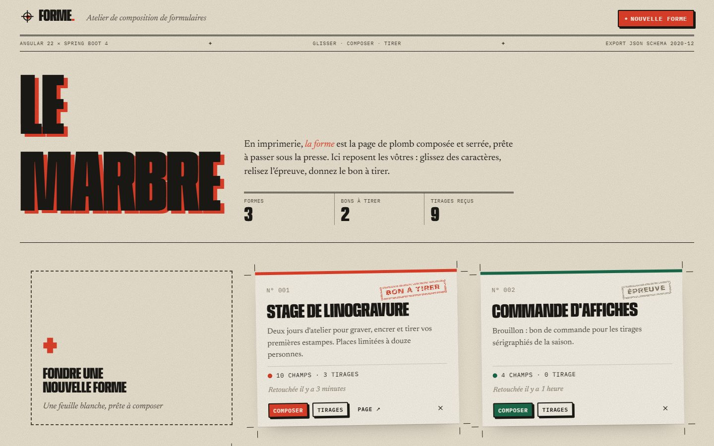
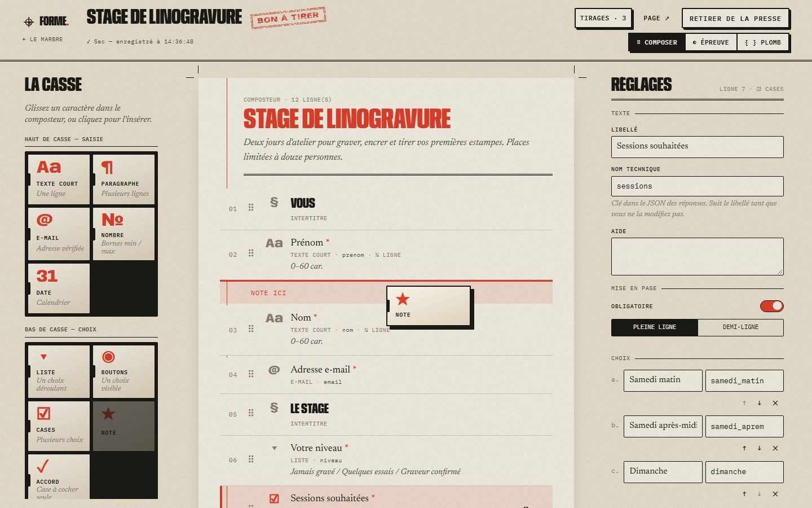
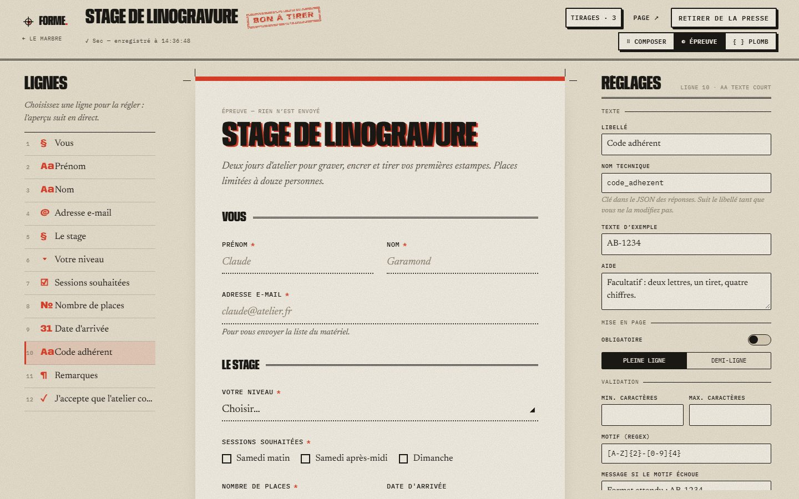
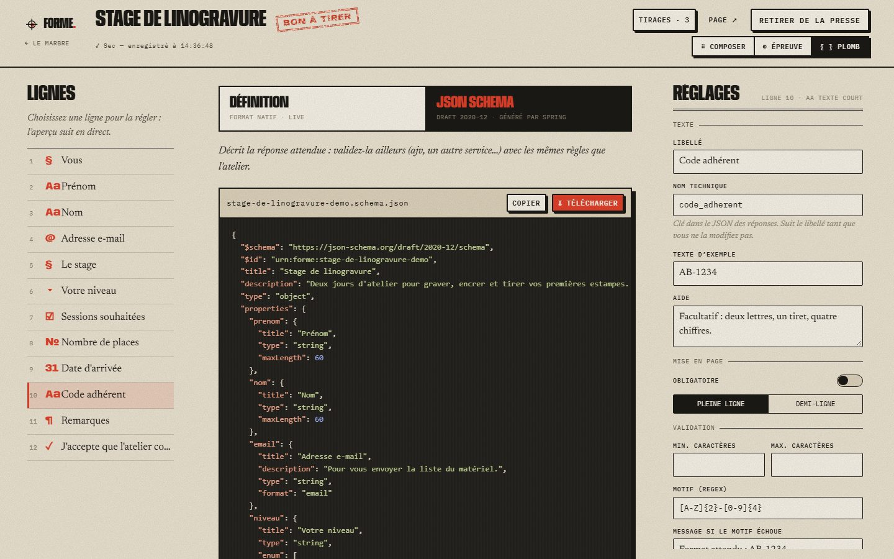
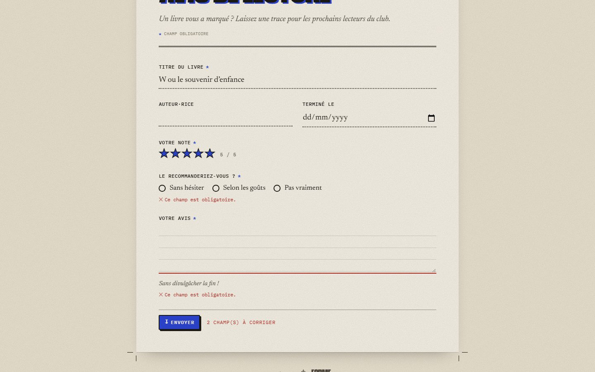

# Forme — atelier de composition de formulaires

Constructeur de formulaires en **glisser-déposer** : champs configurables, validation, aperçu en direct et export du schéma.
Front **Angular 22**, back **Java 21 / Spring Boot 4**, base **PostgreSQL**. Tout se lance avec une commande Docker.

> En imprimerie, *la forme* est la page de plomb composée et serrée, prête à passer sous la presse.
> L'interface file la métaphore jusqu'au bout : on pioche des **caractères** dans **la casse**, on les aligne dans
> **le composteur**, on relit **l'épreuve**, on coule **le plomb** (export) puis on donne **le bon à tirer** (publication).



## Essayer en 30 secondes

```bash
docker compose up --build
```

Puis ouvrir **http://localhost:8088**. Trois formes de démonstration (dont deux publiées, avec des réponses) sont créées
au premier démarrage par une migration Flyway. Arrêt : `Ctrl+C`, puis `docker compose down` (ajouter `-v` pour repartir
d'une base vide).

| Service    | Image                                  | Rôle                                                  |
| ---------- | -------------------------------------- | ----------------------------------------------------- |
| `frontend` | nginx (build Angular multi-étapes)     | Sert le SPA sur `:8088` et relaie `/api` vers Spring  |
| `backend`  | JRE 21 (build Maven multi-étapes)      | API REST, validation, export JSON Schema              |
| `db`       | postgres:17-alpine                     | Formes et réponses (colonnes `jsonb`)                 |

## Fonctionnalités

- **Glisser-déposer** (Angular CDK) de 11 types de champs : texte, paragraphe, e-mail, nombre, date, liste, boutons
  radio, cases à cocher, note en étoiles, case d'accord, intertitre. Clic sur un caractère = insertion après la ligne
  sélectionnée (clavier, mobile).
- **Réglages par champ** : libellé, nom technique (dérivé automatiquement du libellé), aide, texte d'exemple,
  obligatoire, demi-ligne, bornes, longueur, expression régulière et son message, choix réordonnables.
- **Épreuve en direct** : le formulaire réel se met à jour pendant qu'on règle un champ, et peut être rempli pour tester
  les validations — le JSON qui serait envoyé est affiché.
- **Validation en miroir** : mêmes règles et mêmes messages côté Angular (retour immédiat) et côté Java (autorité).
  Les clés inconnues envoyées à l'API sont ignorées.
- **Plomb (export)** : la définition native (`.forme.json`) et un **JSON Schema draft 2020-12** généré par le backend,
  à copier ou télécharger.
- **Publication** (« bon à tirer ») : page publique `/f/{slug}`, accusé de réception, **registre des réponses** et
  **export CSV**.
- **Enregistrement automatique** (debounce), raccourcis clavier (`Alt+↑/↓`, `Ctrl+D`, `Suppr`, `Échap`, `Ctrl+S`).

| Composer                                         | Épreuve en direct                        |
| ------------------------------------------------ | ---------------------------------------- |
|  |  |

| Plomb : JSON Schema                                   | Page publique                                  |
| ----------------------------------------------------- | ---------------------------------------------- |
|    |  |

## Parti pris graphique

Pas de kit d'interface : tout le CSS est écrit à la main autour de la métaphore de l'atelier typographique.

- **Papier et encres** : fond crème avec grain SVG (`feTurbulence`), encre noire et une encre d'accent au choix par
  forme (vermillon, outremer, vert sapin, prune), appliquée via `[data-ink]`.
- **Typographie** : *Anybody* (axe de chasse variable — le logo s'étire au survol), *Newsreader* pour le texte,
  *IBM Plex Mono* pour les étiquettes techniques.
- **Détails d'imprimerie** : traits de coupe autour des feuilles, défaut de repérage sur les titres, tampons encreurs
  usés (masque SVG) pour les statuts, boutons en « blocs de plomb » qui s'enfoncent au clic, caractères de la casse avec
  leur cran, champs imprimés en lignes pointillées.

## Architecture

```
forme/
├── backend/                 Spring Boot 4 (Java 21)
│   └── src/main/java/dev/forthtilliath/formbuilder/
│       ├── form/            Entité Form, API /api/forms, CompositionChecker (cohérence d'une composition)
│       ├── form/field/      Records FieldDefinition / FieldRules / FieldOption (stockés en jsonb)
│       ├── submission/      Réponses, SubmissionValidator, API publique /api/public/forms/{slug}
│       ├── schema/          JsonSchemaExporter (JSON Schema 2020-12)
│       └── common/          ProblemDetail (RFC 9457), slugs, convertisseur JSON → jsonb
├── frontend/                Angular 22 (standalone, signals, zoneless)
│   └── src/app/
│       ├── core/            Modèles, API, validateurs miroir, catalogue des caractères
│       ├── shared/          Formulaire imprimé (rendu partagé épreuve / page publique), tampons, traits de coupe…
│       └── features/        library (le marbre), builder (l'atelier), public-form, submissions
└── docker-compose.yml       db + backend + frontend
```

Quelques choix :

- **Une composition = une colonne `jsonb`.** Les champs sont des records Java sérialisés tels quels : le format stocké
  est aussi le format exporté, sans table par type de champ. Hibernate valide le schéma, Flyway le versionne.
- **Un seul rendu de formulaire** (`PrintedForm`) pour l'aperçu de l'atelier et la page publique : aucun écart possible
  entre ce qu'on relit et ce que reçoivent les répondants.
- **Store de l'atelier en signals** (`BuilderStore`), fourni au niveau de la page ; `httpResource` pour les lectures,
  `linkedSignal` pour reconstruire le `FormGroup` sans perdre la saisie quand la composition change.
- **Erreurs d'API** au format ProblemDetail avec une clé `errors` par champ (`fields[2].name`, `email`…), affichées au
  bon endroit côté front.

### API

| Méthode | Route                                     | Description                              |
| ------- | ----------------------------------------- | ---------------------------------------- |
| GET     | `/api/forms`                              | Liste (avec nombre de champs et réponses) |
| POST    | `/api/forms`                              | Nouvelle forme                           |
| GET/PUT/DELETE | `/api/forms/{id}`                  | Lire / enregistrer / supprimer           |
| POST    | `/api/forms/{id}/publish` · `/unpublish`  | Bon à tirer / retrait                    |
| GET     | `/api/forms/{id}/json-schema`             | Export JSON Schema 2020-12               |
| GET     | `/api/forms/{id}/submissions`             | Réponses reçues                          |
| GET     | `/api/public/forms/{slug}`                | Forme publiée                            |
| POST    | `/api/public/forms/{slug}/submissions`    | Répondre (201, ou 422 + erreurs par champ) |

## Développement local

Prérequis : Node.js 22+, Java 21+, Docker (pour PostgreSQL). Maven n'est pas requis (wrapper inclus).

```bash
npm install && npm --prefix frontend install
npm run dev        # PostgreSQL (docker, port 5435) + Spring Boot (:8081) + ng serve (:4200, proxy /api)
```

| Commande                                   | Effet                                     |
| ------------------------------------------ | ----------------------------------------- |
| `cd backend && ./mvnw test`                | Tests JUnit (validation, cohérence, export, JSON) |
| `npm --prefix frontend test`               | Tests Vitest (validateurs, store, catalogue…) |
| `npm --prefix frontend run lint`           | ESLint                                    |

## Code partagé

Le front s'appuie sur mes paquets [`@forthtilliath/*`](https://github.com/Forthtilliath/forthtilliath-packages) :

- `@forthtilliath/ts-kit` : `randomId`, `slugify`, `debounce` (autosave), `swapItems`, `deepClone`,
  `formatRelativeTime`, `pluralize`, `escapeHtml`, `toCsv` / `downloadCsv`, `downloadTextBlob`, `sum`
- `@forthtilliath/ts-types` : `Brand` (identifiants typés)
- `@forthtilliath/eslint-config` (config Angular) et `@forthtilliath/typescript-config` (base `angular.json`)
